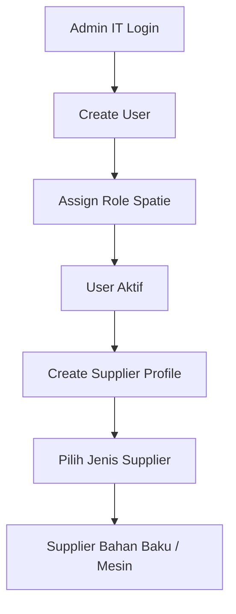
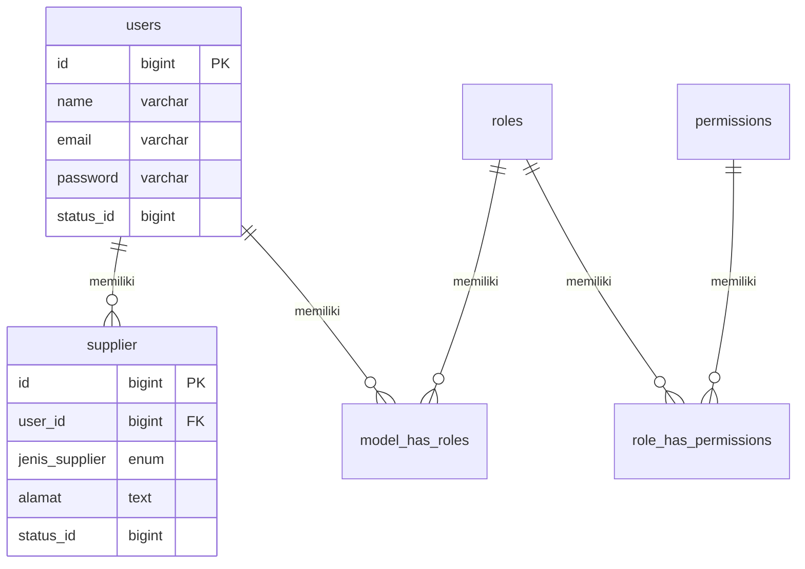
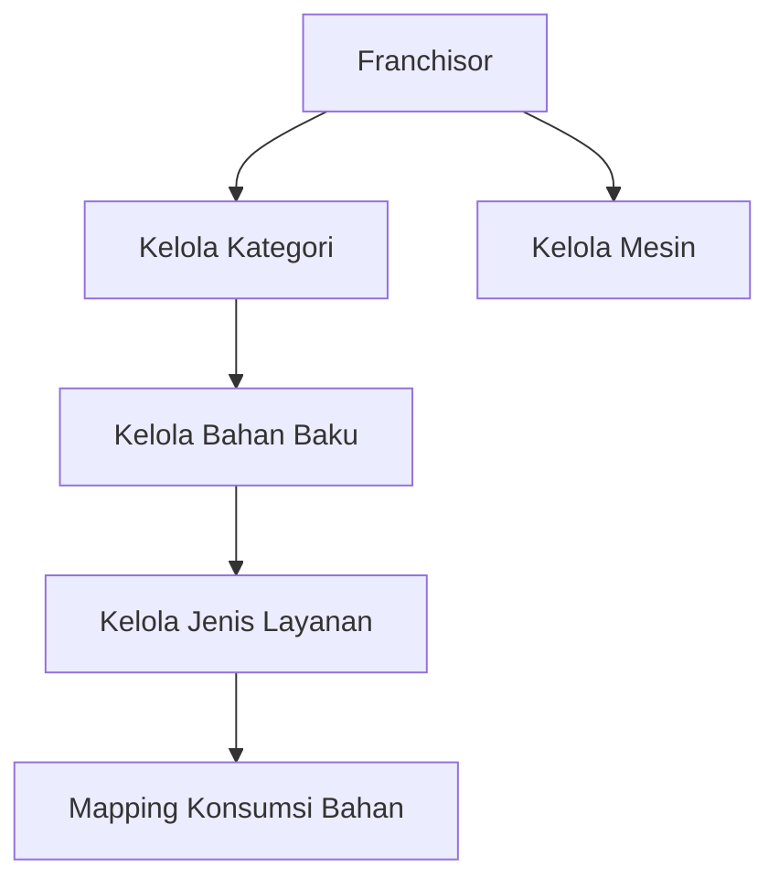
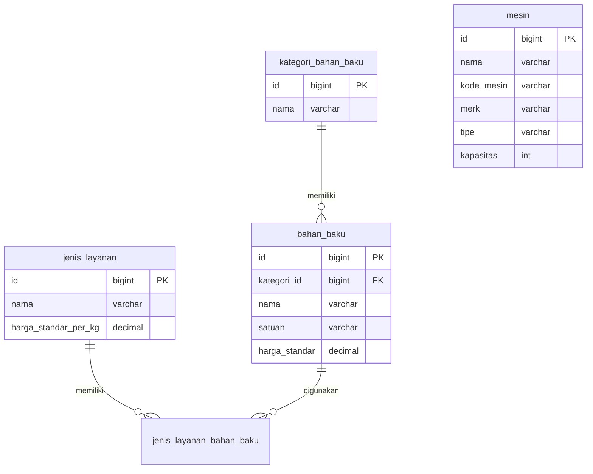
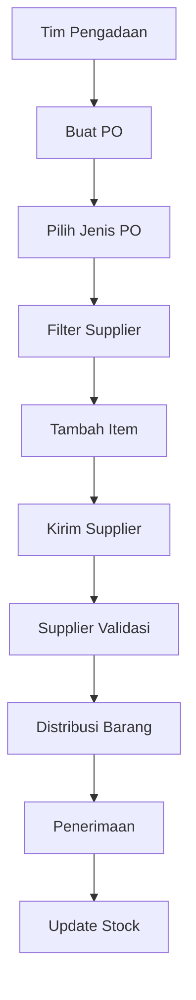
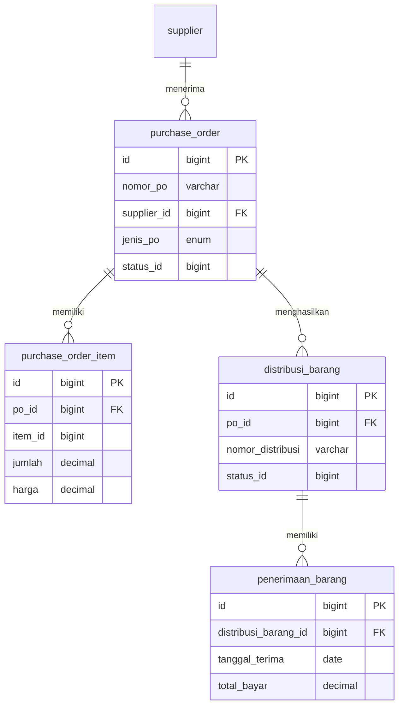
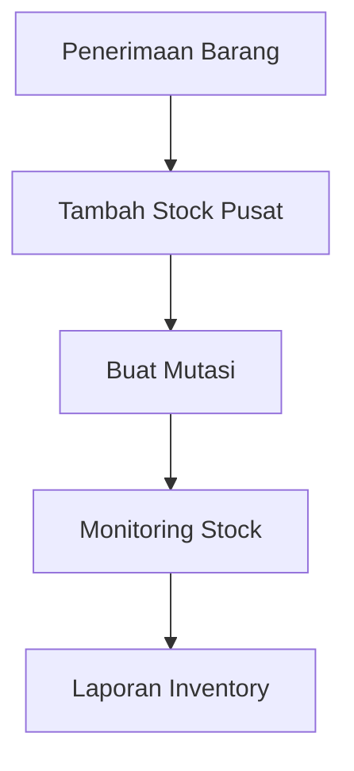
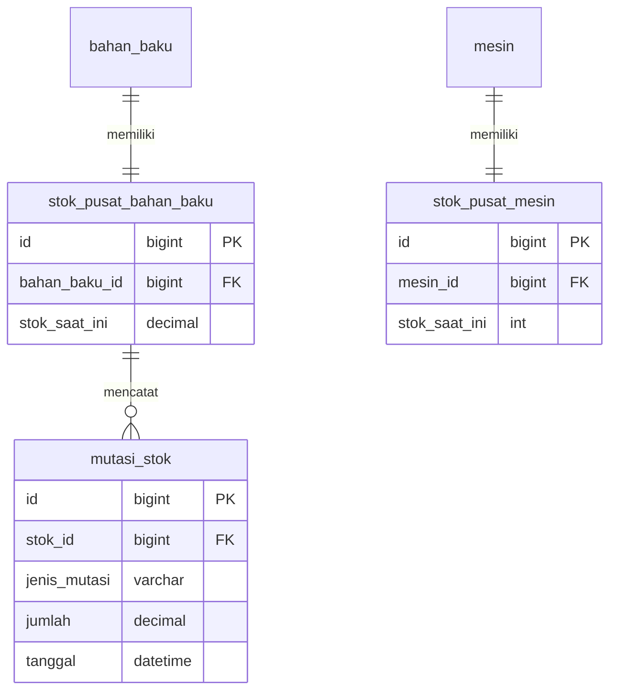

# PRD Backend API WashHub (Laravel 13)

## 1. Overview
Sistem backend REST API untuk manajemen franchise laundry WashHub menggunakan Laravel 13, MySQL, Sanctum Authentication, dan Spatie Permission.

## 2. Scope Modul
- Modul 1: Account & Supplier Management
- Modul 2: Data Master
- Modul 3: Procurement
- Modul 4: Inventory

---

# Modul 1 Account & Supplier

## Flow


## ERD


---

# Modul 2 Data Master

## Flow


## ERD


---

# Modul 3 Procurement

## Flow


## ERD


---

# Modul 4 Inventory

## Flow


## ERD


---

# Permission Matrix

| Role | Hak Akses |
|-|-|
| admin_it | user, role, permission |
| franchisor | master data |
| procurement | supplier, PO |
| supplier | validasi PO |
| manager_outlet | inventory outlet |

---

# API Structure

```
/api/auth
/api/users
/api/roles
/api/permissions

/api/suppliers

/api/master/categories
/api/master/materials
/api/master/services
/api/master/machines

/api/procurement/purchase-orders
/api/procurement/distributions
/api/procurement/receipts

/api/inventory/stocks
/api/inventory/mutations
```
